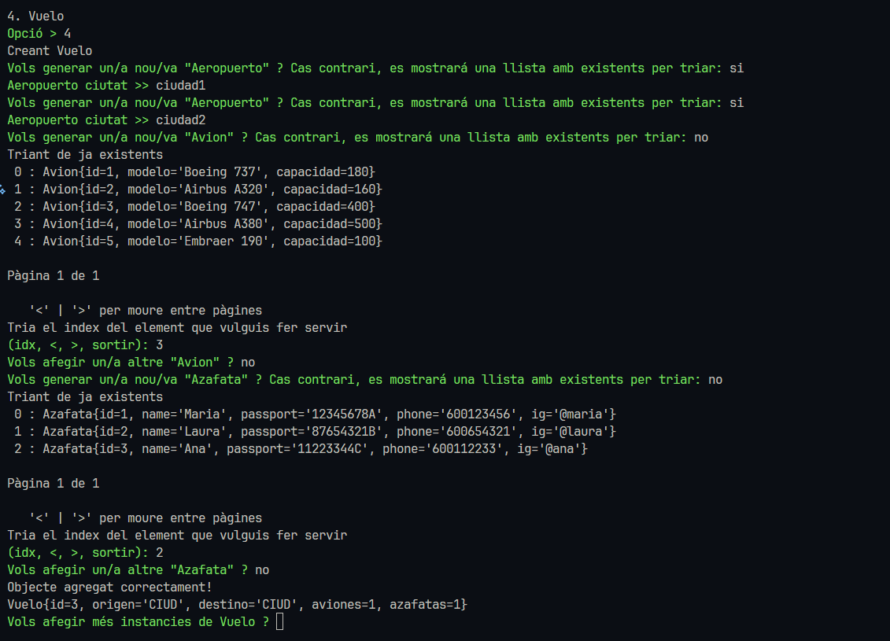

# M06-UF2-JDBC

El projecto cuenta con plugins para ejectutar el programa usando mvn o para compilar un jar.

## Preparación

Primero que nada asegurarse de estar en la misma carpeta del pom.xml (gestor_jdbc)

`cd gestor_orm` <br>

Para ejecutar: `mvn compile exec:java`<br>
O usando la funcion de ejecución de vscode

<br>

Recomiendo modificar las credenciales de conexion a la base de datos y si es necesario.


## Funcionamiento

El gestor ofrece las funciones básicas de un CRUD. Se conecta a la base de datos y crea las tablas necesarias (DDL).

Luego permite las siguientes opciones:

```bash
    1. CARREGAR DADES DE PROVA
    2. INSERIR NOVES DADES (CREATE)
    3. CONSULTAR DADES (READ)
    4. MODIFICAR DADES (UPDATE)
    5. ELIMINAR DADES (DELETE)
    6. SORTIR
    (cancel, .exit per cancelar comandes o sortir del programa)
```

Luego de que se ha conectado es recomendable darle a la opción 1, para cargar los datos de prueba o demo. <br>

### 1 : Cargar datos de prueba

Carga un script DML que hace inserts de datos demo a las tablas de la bbdd.

### 2 : Insertar nuevos datos

Pregunta de que entidad se quiere insertar datos y procede a un formulario que pregunta por las propiedades de la entidad


<br>

En cualquier momento se puede cancelar el comando:


<br>

Dependiendo de la complejidad de la entidad, el programa permite generar entidades requeridas para las entidades. Si la entidad contiene un listado
de entidades (Set), también generar un listado, en el siguiente ejemplo crearé un Vuelo el cual es muy complejo.
<br>

En la siguiente imagen se puede apreciar como si el campo es requerido, el programa obliga a colocar un valor para este. El error fue generado por intentar obtener un aeropuerto de una lista sin resultados.


<br>


En la siguiente imagen se muestra como puede ir creando aviones sin sesar. Muestra dos errores, uno por haber intepretado Jet como no en la pregunta de si generar u obtener, y el otro error por intentar introducir un modelo muy corto.


<br>

En la siguiente imagen tambien muestro un listado de insersion de azafatas en este caso, y el resultado de la creacion del avión es un 
toString del objeto creado despues de haber insertado el objeto en la base de datos correctamente, con su ID asignado.


### 3 : Consultar datos

Permite consultar datos de todas las entidades, primeramente pide la entidad de la cual se quiere consultar.
<br>

Luego muestra las opciones de filtrado segun la entidad, puesto que hay entidades con diferentes campos.


<br>

Y asi con cada entidad. Ahora mostrando por ejemplo el resultado de los datos de la demo:

<br>

Ejemplo de select filtrando string, en este ejemplo filtro azafatas que tengan una r en el ig:

<br>


### 4 : Modificar datos

Permite modificar los campos de cualquier tipo de entidad, obviamente primero pide elegir a que entidad se quiere modificar.
<br>

Luego pide el ID de la entrada que se quiere modificar:

<br>

Si se encuentra un resultado, mostrará cada campo con su valor actual y preguntando si se desea modificar el campo.

<br>
Y al final muestra el resultado de la modificación.


### 5 : Eliminar datos

Eliminar funciona facilmente, preguntando primeramente la entidad, y luego dando dos modalidades de eliminación.
<br>

La primera modalidad permite borrar solo una entrada por su ID:

<br>

La segunda modalidad permite borrar todas las entradas de esa entidad (tabla).


## Extras

### Eliminar base de datos

Al intentar salir del programa, pregunta si se desea borrar la base de datos, esto es util para hacer pruebas.
Lo agregué para hacer mis pruebas más facilmente, pero tambien lo dejo a disposicion por si se necesita.


<br>

### Salir de comandos y de programa

El programa permite salirse de cualquier prompt ya sea en cualquier comando o input. Es riesgoso cancelar un comando como insert, puesto 
que podria hacer que algunos cambios no se apliquen, por ejemplo hacer un cancel de agregar un listado Set, podria hacer que no se guarden
los elementos que se estaban agregando a esa lista set. Ya que escribir cancel lanza una excepcion que previene que se guarde el valor.


<br>

Ejemplo de ejecucion de ".exit"


### Generalización técnica

El programa está hecho de una manera muy generalizada, haciendo uso de Tipos Genericos en las clases, haciendo uso de la interfaz [PropertyProvider](./gestor_orm/src/main/java/com/accesadades/orm/model/Property.java),
etc. <br><br>

**Por qué o para que?**: Esta interfaz hace que cada modelo o entidad de un listado de propiedades que son las que luego se usan para, 
generar prompts de la propiedad que se quiere modificar, ejecutar el setter de esa propiedad, obtener el tipo de esa propiedad, y entre otras cosas más.
<br><br>

El uso de esta interfaz me ha facilitado no tener que hacer funciones especificas para cada entidad, sino que con una sola funcion, defino
un comportamiento general para todas; que propiedad tiene el modelo, el nombre, el tipo, y cosas avanzadas como llamar recursivamente una función,
en caso de que el tipo de propiedad sea otra entidad.
<br>

En resumen, está muy chulo poderlo generalizar asi.<br><br>

**Contras**: Al ser estas cosas tan generalizadas, es complicado ahora entonces hacer comportamientos especificos para cada entidad, por ejemplo,
hacer un group by, puesto que las entidades son tan diferentes, conseguir hacer un group by generalizado es complicado.

### Uso de datos ya generados

En caso de querer reutilizar algun dato a la hora de crear otro, se puede. En ejemplos anteriores solo he creado directamente, pero también
se pueden reutilizar datos ya existentes y de manera comoda usando la clase [Paginator](./gestor_orm/src/main/java/com/accesadades/orm/util/Paginator.java)<br>

